# Mermaid Diagrams - Quick Reference

Quick access to all Mermaid diagrams for presentations and documentation.

---

## 🎯 System Overview

High-level architecture showing all components and their relationships.


**Use for**: High-level system explanation, architecture overview presentations

---

## 🔄 Commander Workflow

Complete 4-phase incident response workflow with decision trees.


**Use for**: Detailed workflow explanation, demo walkthrough, technical deep-dive

---

## 📡 Event Flow Sequence

Real-time event communication between components.


**Use for**: Understanding event-driven architecture, debugging, timing analysis

---

## 🏗️ Class Structure

Object-oriented design with inheritance and relationships.


**Use for**: Code structure explanation, OOP concepts, API design

---

## 🔄 State Machine

Commander state transitions throughout incident response.


**Use for**: State management explanation, phase transitions, status tracking

---

## 🔌 LLM Integration Flow

Detailed streaming communication with NVIDIA API.


**Use for**: LLM integration explanation, streaming architecture, API usage

---

## 📊 Event Types Reference

Quick visual reference for all event types and their usage.

```mermaid
graph LR
    subgraph "Event Types"
        Thinking[🤔 THINKING<br/>Internal reasoning]
        Action[⚡ ACTION<br/>Tool usage/delegation]
        Observation[👁️ OBSERVE<br/>Evidence gathering]
        Theory[💡 THEORY<br/>Root cause hypothesis]
        Challenge[⚔️ CHALLENGE<br/>Theory debate]
        Decision[⚖️ DECISION<br/>Final determination]
    end

    subgraph "Metadata Examples"
        M1[severity: 'high'<br/>priority: list]
        M2[tool: 'name'<br/>args: dict]
        M3[theory_count: int<br/>source: 'agent']
        M4[confidence: 0.85<br/>pattern: 'string']
        M5[theory_id: 'id'<br/>challenge: 'text']
        M6[confidence: float<br/>root_cause: 'string']
    end

    Thinking -.-> M1
    Action -.-> M2
    Observation -.-> M3
    Theory -.-> M4
    Challenge -.-> M5
    Decision -.-> M6

    style Thinking fill:#e1bee7
    style Action fill:#fff9c4
    style Observation fill:#b2ebf2
    style Theory fill:#c5e1a5
    style Challenge fill:#ffccbc
    style Decision fill:#f8bbd0
```



**Use for**: Event system explanation, metadata reference, debugging guide

---

## 🔧 Component Interaction

Data flow and component relationships during runtime.


**Use for**: Runtime behavior explanation, data flow tracking, initialization sequence

---

## 📝 Usage Tips

### For Presentations
1. **Start with System Overview** - Show high-level architecture
2. **Walk through Workflow** - Use Commander Workflow diagram
3. **Show Real-time Events** - Event Flow Sequence diagram
4. **Explain LLM Integration** - LLM Integration Flow diagram

### For Documentation
- Embed diagrams in README or wiki pages
- Use as reference for new developers
- Include in architecture decision records

### For Development
- Use State Machine for debugging phase transitions
- Reference Class Structure for API design
- Consult Event Types for proper event usage

### Rendering Diagrams
```bash
# Install Mermaid CLI (optional)
npm install -g @mermaid-js/mermaid-cli

# Generate images from diagrams
mmdc -i MERMAID_DIAGRAMS.md -o diagrams/

# Or use online editor
# https://mermaid.live/
```

### GitHub Support
GitHub natively renders Mermaid in markdown files. Simply push this file and diagrams will display automatically.

---

## 🎯 Quick Links

- Full Documentation: `AGENT_ARCHITECTURE.md`
- Code Implementation: `agents/` directory
- Quick Start: `QUICK_START_49B.md`
- Hackathon Guide: `HACKATHON_GUIDE.md`

---

**All diagrams maintained for GTC Hackathon 2024**
